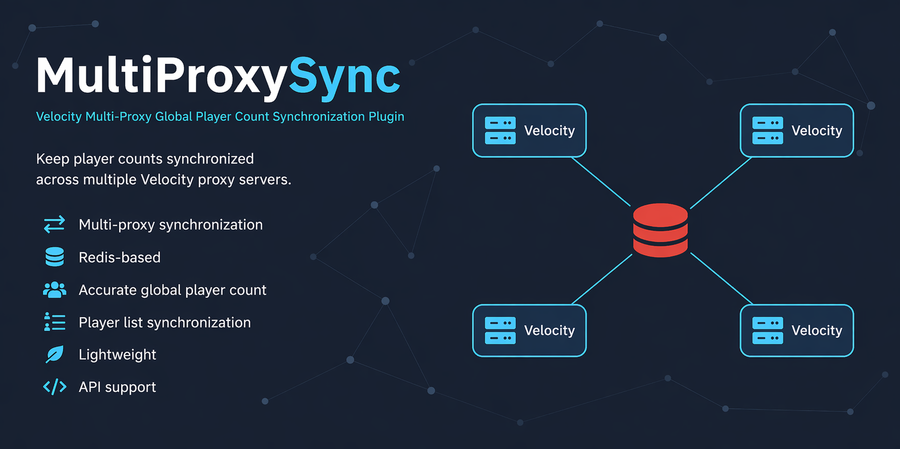

# MultiProxySync


[**English**](https://github.com/User-Time/MultiProxySync) | [**中文**](https://github.com/User-Time/MultiProxySync/blob/master/Readme_zhCN.md)

<p align="center">
  
</p>

---

**MultiProxySync** is a Velocity plugin for distributed proxy networks.  
It uses **Redis** to synchronize player counts and player lists across multiple Velocity proxies, so your network can present a consistent global player count and shared player data across all entry points.

---

## ✨ Features

- **Global synchronization**  
  Synchronizes player counts and player lists across multiple Velocity proxies.

- **Accurate player statistics**  
  Keeps the displayed online count consistent across the network.

- **Self-healing cleanup**  
  Removes stale proxy data automatically when a node crashes or goes offline unexpectedly.

- **Redis-powered**  
  Uses Redis for fast and lightweight shared state synchronization.

- **Public API**  
  Exposes synchronized proxy and player data for use in other plugins.

- **Maven Central distribution**  
  The API can be added through Maven Central without manually installing local JAR files.

---

## 📦 Requirements

- **Velocity** proxy server
- **Redis** database

---

## 🛠️ Installation

1. Make sure a **Redis** server is available.
2. Download `multiproxysync-plugin-2.0.0.jar`.
3. Place it in the `plugins` folder of all Velocity proxy instances.
4. Start each proxy once to generate the configuration file.
5. Edit the generated `config.yml`.
6. Restart all proxy instances.

---

## 📄 Configuration

```yaml
plugin:
  serverName: Proxy-01
  enabled: true

redis:
  host: 127.0.0.1
  port: 6379
  password: YourPassword
```

### Notes

- `serverName` must be unique for each proxy node.
- `enabled` controls whether the plugin initializes and registers its API.
- All proxy nodes should connect to the same Redis instance.

---

## 📦 API

<details>
<summary>Click to expand</summary>

### Maven

```xml
<dependency>
    <groupId>top.time-blog</groupId>
    <artifactId>multiproxysync-api</artifactId>
    <version>2.0.0</version>
    <scope>provided</scope>
</dependency>
```

### Gradle

```kotlin
dependencies {
    compileOnly("top.time-blog:multiproxysync-api:2.0.0")
}
```

### Available Methods

```java
Set<String> getProxies();
Set<String> getAllPlayers();
Map<String, Set<String>> getPlayersByProxy();
int getAllPlayerCount();
Map<String, Integer> getPlayerCountByProxy();
```

### Usage Example

```java
import top.timeblog.multiproxysync.api.MultiProxySyncAPI;
import top.timeblog.multiproxysync.api.MultiProxySyncProvider;

MultiProxySyncAPI api = MultiProxySyncProvider.getOrNull();
if (api == null) {
    System.out.println("MultiProxySync API is not available yet.");
    return;
}

int totalPlayers = api.getAllPlayerCount();
Set<String> allPlayers = api.getAllPlayers();
Map<String, Integer> countByProxy = api.getPlayerCountByProxy();
Map<String, Set<String>> playersByProxy = api.getPlayersByProxy();

System.out.println("Total players: " + totalPlayers);
System.out.println("All players: " + allPlayers);
System.out.println("Count by proxy: " + countByProxy);
System.out.println("Players by proxy: " + playersByProxy);
```

### API Notes

- The API is read-only.
- Redis connection management remains internal to MultiProxySync.
- Returned player identifiers are UUID strings.
- The API becomes available after plugin initialization has completed.

</details>

---

## 💡 Feedback & Support

If you encounter any issues or have ideas for improvements, feel free to open an issue:

👉 https://github.com/User-Time/MultiProxySync/issues

---

## 📝 License

This project is licensed under the **Apache License 2.0**.
